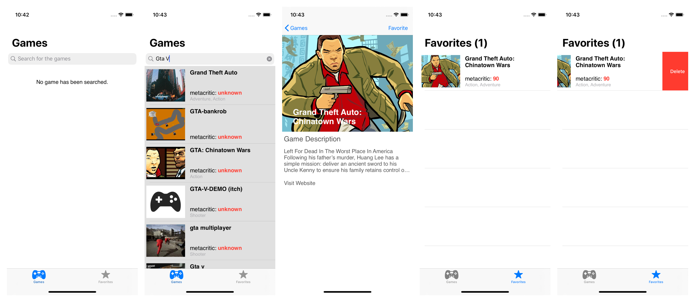

# GameStore
GameStore is an app that helps to discover new games. I used MVVM structure because I believe that it has better separation of concerns and view models make easier to write unit tests. I implemented almost all featuress for GameStore app but if I have more time I can spend the time to improve auto layout experince and to increase unit test coverage. I realy like add favotire feature in GameStore app because it works perfectly! :D Gamestore app absolutly ready to send to App Store but we may add some monitzation like in-app purchase or advertisment. I did not spend time for bonus question but I think the read more feature is required before send appstore :) 

